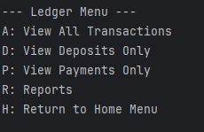
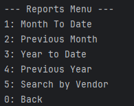

# 💰 Accounting Ledger Application

A Java-based Command Line Interface (CLI) application that allows users to track financial transactions, including deposits and payments, and view detailed ledger reports. This is Capstone Project 1 for the Java Development Fundamentals course.

---
### 🏠 Home Screen


The Home Screen is the main menu of the application. From here, users can:
- Add a new deposit (`1`)
- Make a payment or debit (`2`)
- View the transaction ledger (`3`)
- Exit the application (`4`)

The app continues running until the user chooses to exit.

---


## 📌 Features


### 📒 Ledger View

 

The Ledger View displays all financial transactions, with the most recent ones shown first. Users can filter the ledger to:
- View all transactions (`A`)
- Show deposits only (`D`)
- Show payments/debits only (`P`)
- Access the Reports screen (`R`)
- Return to the Home screen (`H`)

---
- 📊 Reports:
- 
-
    - Month-to-Date
    - Previous Month
    - Year-to-Date
    - Previous Year
    - Search by Vendor
    - 🔍 Custom Search (by date, vendor, description, amount)
- 💾 Persists all data to `transactions.csv`

---

## 🛠️ Technologies Used

- Java 17+
- Java IO & NIO for File Handling
- Java Time API for date filtering
- Git + GitHub for version control

---

## 🚀 Getting Started

1. Clone the repository:
   ```bash
   git clone https://github.com/LesleyCloud1/AccountingLedger.git